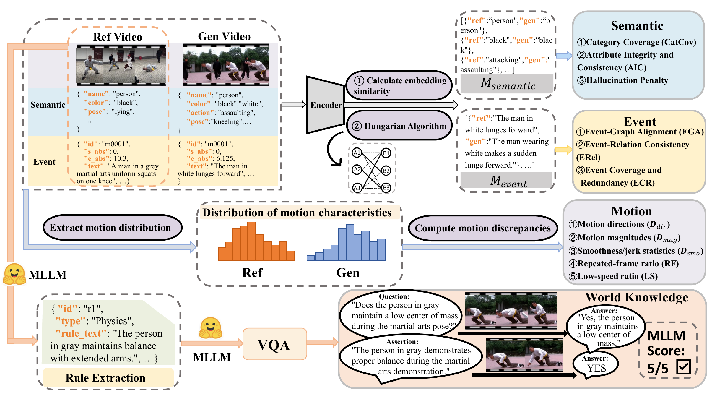

## [CVPR 2026] Ref4D-VideoBench: Four-Dimensional Reference-Based Evaluation of Text-to-Video Generative Models

[](https://cvpr.thecvf.com/virtual/2026/poster/36624)
[](data/metadata/ref4d_videobench_reference_sources.csv)
[](LICENSE)
[](#citation)

Ref4D-VideoBench is a reference-based benchmark for evaluating text-to-video generation beyond prompt-level matching. Given a generated video and its paired reference assets, Ref4D measures whether the generation preserves the reference semantics, event progression, motion dynamics, and world-knowledge constraints.



## Overview

Most text-to-video benchmarks evaluate whether a video matches a text prompt. Ref4D-VideoBench instead uses a reference video as structured evidence: each sample contains a target prompt and reference-side evidence for semantic alignment, event temporal understanding, motion dynamics, and world knowledge. A generated video is evaluated against these reference assets to test whether it preserves the intended content and dynamics.

This repository currently releases the evaluation code for semantic, event, motion, and world-knowledge dimensions.

## Benchmark Format and Evaluation Dimensions

Generated videos are organized by model name:

```text
data/genvideo/<modelname>/<sample_id>.mp4
```

Each `<sample_id>` should match the released metadata and reference assets under `data/metadata/`.

| Dimension | Goal | Main Inputs | Summary Output |
| --- | --- | --- | --- |
| Semantic Alignment | Measures entity coverage, attribute integrity and binding consistency, and hallucination suppression. | Semantic evidence JSONs for reference and generated videos. | `semantic_scores_summary.csv` |
| Event Temporal Understanding | Measures event correspondence, temporal order, and event-level consistency. | Reference-side merged event evidence and generated videos. | `event_scores_summary.csv` |
| Motion Dynamics | Measures direction, magnitude, smoothness, and degeneration signals. | Motion reference caches and generated videos. | `motion_scores_summary.csv` |
| World Knowledge | Measures reference-grounded physical, causal, and common-sense constraints. | World QA bank (assertions and VQA items) and generated videos. | `world_scores_summary.csv` |

## Installation

Clone the repository:

```bash
git clone https://github.com/TAILab-W/Ref4D-VideoBench.git
cd Ref4D-VideoBench
```

Create the conda environments:

```bash
conda env create -f envs/ref4d_semantic_world.yml
conda env create -f envs/ref4d_event.yml
conda env create -f envs/ref4d_motion.yml
```

Install the repository inside the environment you are using:

```bash
conda activate ref4d_semantic_world
bash scripts/install_env.sh
```

Some evaluators depend on third-party checkpoints and model weights. Place them under `checkpoints/` or follow the paths described in [docs/QUICKSTART.md](docs/QUICKSTART.md). The evaluators use separate environments because their GPU/CUDA dependencies differ.

## Data Preparation

Official metadata and reference-side caches are versioned in this repository under:

```text
data/metadata/
```

The released benchmark caches include the sample metadata, prompts, semantic evidence, event evidence and embeddings, motion references, and the world-knowledge QA bank. `data/metadata/semantic_event_evidence/` is a derived merge cache used by prompt and custom-reference construction; it can be regenerated from the released semantic and event evidence when needed.

The reference-source index is available at `data/metadata/ref4d_videobench_reference_sources.csv`. It is provided as provenance metadata for research reproducibility and auditing. Ref4D-VideoBench does not redistribute source videos, frames, audio, subtitles, or thumbnails. Source availability and platform metadata may change over time, and some public source videos may become unavailable after collection. Users are responsible for obtaining and using any source videos in compliance with platform terms and rights-holder permissions.

Place generated videos as:

```text
data/genvideo/<modelname>/<sample_id>.mp4
```

Example:

```text
data/genvideo/my_model/ref4d_0001.mp4
data/genvideo/my_model/ref4d_0002.mp4
```

`data/genvideo/` is only the default root. Wrapper scripts also accept `GEN_VIDEO_ROOT=/path/to/videos` as long as the layout remains `<video_root>/<modelname>/<sample_id>.mp4`.

## Quick Start

Run semantic, event, motion, and world-knowledge evaluation:

```bash
USE_CONDA_ENVS=1 \
MODELS=my_model \
OUTPUT_SUFFIX=run1 \
bash scripts/run_4d_eval.sh --dims semantic,event,motion,world
```

If your generated videos live outside `data/genvideo/`, set `GEN_VIDEO_ROOT` once before running the evaluation commands.

You can also run each dimension separately:

```bash
export GEN_VIDEO_ROOT=/path/to/videos
export MODELS=my_model

bash scripts/run_semantic_eval.sh
bash scripts/run_event_eval.sh
bash scripts/run_motion_eval.sh
bash scripts/run_world_eval.sh
```

Default summary files are written to:

```text
outputs/semantic/scores/semantic_scores_summary.csv
outputs/event/scores/event_scores_summary.csv
outputs/motion/scores/motion_scores_summary.csv
outputs/world/scores/world_scores_summary.csv
```

For detailed setup, checkpoint paths, and troubleshooting, see [docs/QUICKSTART.md](docs/QUICKSTART.md).

## Evaluate Your Own Videos / Custom References

Ref4D-VideoBench can also be used with custom reference videos:

1. Prepare custom reference videos and metadata.
2. Build semantic, event, motion, and world-knowledge reference caches.
3. Generate prompts from the reference-side assets.
4. Place generated videos under the matching model/sample layout.
5. Run the same semantic, event, motion, and world-knowledge evaluators.

See [docs/CUSTOM_REFERENCE.md](docs/CUSTOM_REFERENCE.md) for the full custom-reference workflow, including semantic evidence extraction, event evidence and embedding construction, motion reference-cache construction, world-knowledge QA-bank construction, and prompt generation.

## License

The original Ref4D-VideoBench code and documentation are released under the [Apache License 2.0](LICENSE). Third-party components under `third_party/` retain their original licenses. Please check each upstream directory for its license and citation requirements.

The source videos are not licensed by this repository. The reference-source index is factual provenance metadata and does not grant rights to the underlying videos. Source videos remain hosted by their original platforms and authors.

## Citation

If you use Ref4D-VideoBench, please cite our paper:

```bibtex
@InProceedings{Wei_2026_CVPR,
    author    = {Wei, Jiajia and He, Yujia and Hou, Yuhan and Qi, Hang and Wang, Sihua and Shi, Jincheng and Li, Kwok Fung and Zheng, Zibin and Wu, Weibin},
    title     = {Ref4D-VideoBench: Four-Dimensional Reference-Based Evaluation of Text-to-Video Generative Models},
    booktitle = {Proceedings of the IEEE/CVF Conference on Computer Vision and Pattern Recognition (CVPR)},
    month     = {June},
    year      = {2026},
    pages     = {7719-7729}
}
```

## Acknowledgements

This repository integrates or builds on several open-source components:
[MiniCPM-V](https://github.com/OpenBMB/MiniCPM-V),
[TransNetV2](https://github.com/soCzech/TransNetV2),
[DDM-Net](https://github.com/MCG-NJU/DDM),
[TAPIR / TAPNet](https://github.com/google-deepmind/tapnet),
[SAM 2](https://github.com/facebookresearch/sam2),
[GroundingDINO](https://github.com/IDEA-Research/GroundingDINO), and
[VideoLLaMA3](https://github.com/DAMO-NLP-SG/VideoLLaMA3).
We thank the authors of these projects and follow their original license terms.
